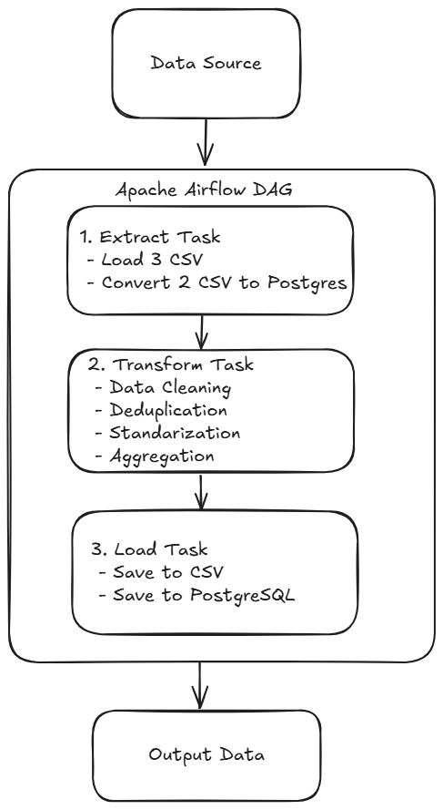

# Transjakarta Data Pipeline

Pipeline ETL (Extract, Transform, Load) untuk memproses data transaksi pelanggan Transjakarta menggunakan Apache Airflow. Pipeline ini berjalan otomatis setiap hari pukul 07:00 WIB untuk menganalisis data transaksi dan menghasilkan insight berdasarkan tipe kartu, rute, dan tarif.

**Version:** 1.0.0

---

## Arsitektur Data



---

## Tech Stack

- Docker
- Apache Airflow 2.7.3
- Python 3.10
- PostgreSQL 13
- Pandas
- SQLAlchemy

---

## How To Use

### Langkah-langkah:

#### 1. Clone Repository
```bash
git clone <repository-url>
cd transjakarta-pipeline
```

#### 2. Setup Data Input
Pastikan semua file CSV ada di folder `data/input/`:
- `dummy_realisasi_bus.csv`
- `dummy_routes.csv`
- `dummy_shelter_corridor.csv`
- `dummy_transaksi_bus.csv`
- `dummy_transaksi_halte.csv`

#### 3. Setup Environment
```bash
# Create required directories
mkdir -p ./dags ./logs ./data/input ./data/output ./scripts ./sql

# Set Airflow UID (for Linux/Mac)
echo -e "AIRFLOW_UID=$(id -u)" > .env
```

#### 4. Start Docker Compose
```bash
# Pull images and start services
docker-compose up -d

# Wait for services to be healthy (2-3 menit)
docker-compose ps
```

#### 5. Access Airflow UI
- **URL:** http://localhost:8080
- **Username:** airflow
- **Password:** airflow

#### 6. Trigger DAG
1. Login ke Airflow UI
2. Cari DAG bernama `transjakarta_pelanggan_pipeline`
3. Toggle switch untuk enable DAG
4. Klik "Trigger DAG" untuk run manual
5. Monitor progress di Graph View atau Log

#### 7. Verifikasi Output

**Check CSV Output:**
```bash
ls -lh data/output/
# Should see:
# - output_by_card_type.csv
# - output_by_route.csv
# - output_by_tarif.csv
```

**Check Database Output:**
```bash
# Connect to PostgreSQL
docker exec -it <postgres-container-id> psql -U airflow -d transjakarta_dwh

# Query tables
SELECT COUNT(*) FROM output_by_card_type;
SELECT COUNT(*) FROM output_by_route;
SELECT COUNT(*) FROM output_by_tarif;
```

#### 8. Stop Services
```bash
docker-compose down

# To remove volumes (clean restart)
docker-compose down -v
```

---

## Output Data

### 1. Output by Card Type
**File:** `output_by_card_type.csv`

**Columns:**
- `tanggal`: Tanggal transaksi
- `card_type`: Jenis kartu (JakCard, BankDKI, dll)
- `gate_in_boo`: True/False (masuk/keluar)
- `jumlah_pelanggan`: Jumlah pelanggan
- `total_amount`: Total amount yang terdeduct

### 2. Output by Route
**File:** `output_by_route.csv`

**Columns:**
- `tanggal`: Tanggal transaksi
- `route_code`: Kode rute (contoh: 1A, 2B)
- `route_name`: Nama rute
- `gate_in_boo`: True/False (masuk/keluar)
- `jumlah_pelanggan`: Jumlah pelanggan
- `total_amount`: Total amount yang terdeduct

### 3. Output by Tarif
**File:** `output_by_tarif.csv`

**Columns:**
- `tanggal`: Tanggal transaksi
- `tarif`: Nilai tarif (contoh: 3500, 5000)
- `gate_in_boo`: True/False (masuk/keluar)
- `jumlah_pelanggan`: Jumlah pelanggan
- `total_amount`: Total amount yang terdeduct

---

## Proses ETL Detail

### Extract Phase
- Load 3 CSV ke memory (realisasi_bus, routes, shelter_corridor)
- Convert 2 CSV ke PostgreSQL:
  - `dummy_transaksi_bus.csv` → `dummy_transaksi_bus` table
  - `dummy_transaksi_halte.csv` → `dummy_transaksi_halte` table
- Extract dari PostgreSQL untuk processing

### Transform Phase

**Data Cleaning:**
- Remove duplicates berdasarkan UUID
- Handle missing values (fill dengan default)
- Convert tipe data (datetime, boolean, integer)

**Standardisasi no_body_var:**
- Format: 3 huruf - 3 angka
- Contoh: `BRT 15` → `BRT-015`
- Contoh: `LGS_251A` → `LGS-251`

**Filter Pelanggan:**
- Hanya ambil records dengan `status_var = 'S'`

**Agregasi Data:**
- Group by tanggal, card_type, gate_in_boo
- Group by tanggal, route_code, route_name, gate_in_boo
- Group by tanggal, tarif, gate_in_boo
- Calculate jumlah_pelanggan dan total_amount

### Load Phase
- Save ke CSV di folder `data/output/`
- Save ke PostgreSQL tables:
  - `output_by_card_type`
  - `output_by_route`
  - `output_by_tarif`

---

## ⏰ Schedule

Pipeline dijadwalkan berjalan otomatis:
- **Waktu:** Setiap hari pukul 07:00 WIB
- **Cron Expression:** `0 7 * * *`
- **Retry:** 2x dengan delay 5 menit

---

## 📝 Logging

Setiap task mencatat:
- Status eksekusi (Success/Failed)
- Jumlah rows processed
- Error messages (jika ada)
- Processing time

Log dapat diakses melalui:
- **Airflow UI:** Task Instance → Log
- **Docker logs:** `docker-compose logs -f airflow-scheduler`
- **File system:** `logs/` directory

